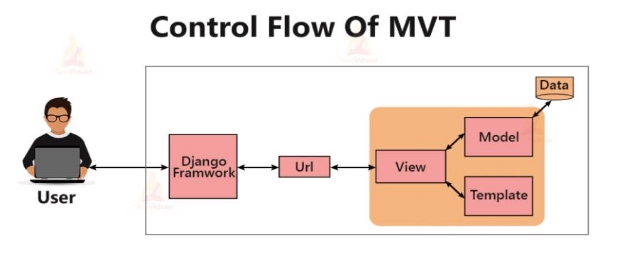
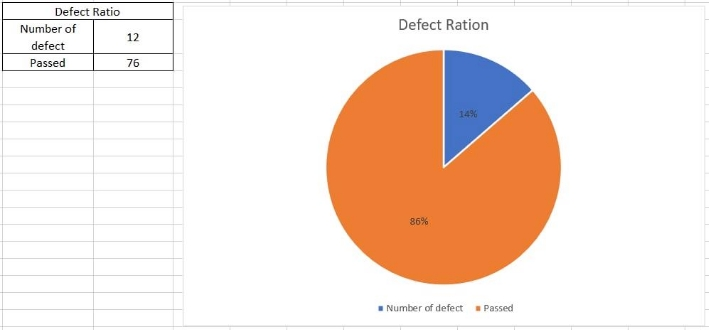
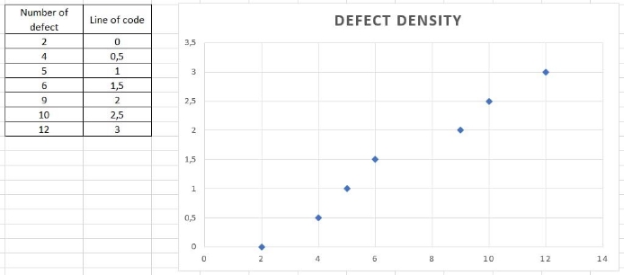
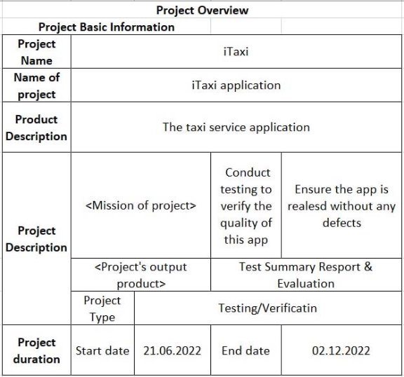
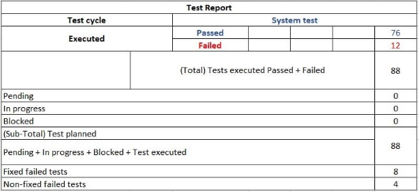

Project name: iTaxi

Team members:

22013138 (Samijonov Boymirzo), 22013092 (Akhmetbekuly Mukhammedali), 20012767 (Khalimbetov Ulugbek).

Table of contents:

1. Introduction 
1. Background 
1. Specification 
1. Design 
1. Implementation 
1. Results and Evaluation
1. Future work 
1. Conclusions
1. Reflection on Learning 
1. References. 

Introduction

Our project – “iTaxi” is a developed version of taxi services, which offers numerous unique opportunities, such as choosing your music playlist, reservations, creating group accounts, etc. The goal of “iTaxi” is to provide comfortable drive for customers, high-fixed salaries for drivers, make simple and practical UI of the application and solve actual problems and uncomfortable elements of the trip. As our project is intended for a wide range of users, we offer different travel options (Standard, Premium, VIP). 

We reached our goal within 69 days; we plot a developed schedule graph and made a Gantt chart. Created specifications to illustrate how the project is divided into days and sections.

CDF Graph

Customer Survey and Research

To hit our goals and understand the expectations of customers we conducted a survey and made deep research.

Then, we created Quality Function Deployment (QFD) to give priority to which functions should be implemented in the first versions of iTaxi.

Facing different kinds of problems helped to find out the weak parts of our project, so we could strengthen the weaknesses and make a comparison with global market leaders. In the list below, you might the companies from which our product is based on,

Opponents in the global market.  

- Uber. Has nearly the same functionality and will be a good opponent.  
- YandexGO. Cannot support the same specifications and does not have a fixed price and customers can bargain.  
- KakaoTaxi. Has no same specifications in choosing a car type, but provides high privacy.

The app is user-friendly, accessible and reliable. It has built-in features e.g., GPS tracking and booking history to make an easy booking. Furthermore, it allows users to share their location with friends or family members so they can be notified when they arrive at their destination. The app also provides time estimation and fare before they book it.

` `**A broad summary of important outcomes from customer research**

Benefits: 

- Shown route
- Driving to the exact location
- Availability of price before the trip
- Availability of time to get to your destination
- Safe delivery
- Different payment options
- Opportunity to choose the car type and model

Weak parts: 

- Bargain. The iTaxi app does not provide a bargaining function to customers.
- Money reduction. Once, the driver is late, the customer has no right to reduce the price.

**Background**

The project is intended to use in a global market. Mostly we focused on mobile usage, but as a blueprint, we made a project by using Django. For creating the database, we used PostgreSQL. Throughout the execution of the project, we faced some difficulties and tried to implement some existing solutions. Here are some of the faced problems:

1. Calling a dispatcher and not knowing the precise address of where you are could lead to some problems for the cab to pick you up. Having a GPS waypoint on a map makes it a lot easier. 
1. Allowing a vantage of carpooling services for customers with split fare 
1. During the implementation design, the UI/UX team encountered the problem of fitting all the data on screen size (Travel options, map, distinct location bar, and current location bar), according to Hick’s law. Currently, there is only one template that is used widely, in all maps (Google map, Naver map, Kakaomap)  
1. As we offer services in South Korea, we face some difficulties with other big companies. 
1. Common problems between drivers and customers. Currently, we think of how to deal with this problem, but it takes some time: [https://www.taxiinsurer.co.uk/contact-us/news/top-5-problems- faced-by-taxi-fleet-owners-and-how-to-solve-them/](https://www.taxiinsurer.co.uk/contact-us/news/top-5-problems-faced-by-taxi-fleet-owners-and-how-to-solve-them/)
1. The algorithm that we use can create a route for walking that is limited and accesses only up to 30 km.  

Specifications

Methodology: 

As our project is not big and the requirements are easily predictable, we decided to steak up with the waterfall model. Project tasks will smoothly go from one process to another. The basic flaw is specifying the requirements, design, implementation, verification and maintenance. On the charts, we specified the flaw of our work and how the task will be spat between group members. As it is alpha testing, it was tested by the developers themselves and the QA team. The remaining budget was spent on corrections and maintenance.

Our implementation of the waterfall model in tool project management tool Click Up:

 

Project structure and Architecture

The objective of the project is to design and deploy a taxi ride-sharing app using the Django Web framework.

Technologies used:

- **HTML5**
- **CSS3**
- **Django**
- **PostgreSQL**
- **JavaScript**
- **Bootstrap**

**Driver Registration** – A logged-in person has to sign in as a driver and inputs their personal information. They are additionally able to get entered and edit their personal information.

**Ride Selection** – If a logged-in person is a part of more than one ride, she has the opportunity to pick the trip she wishes.

**Ride Requesting** – A logged-in person can request a trip. Requesting a trip permits the customer to specify the address, showing arrival time and place, the wide variety of overall passengers from their party, and a car type. The trip can be shared through different customers and other typical requests.

**Ride Request Editing (Owner)** – A trip proprietor has the right to edit the particular asked attributes of the trip so long as the trip is not confirmed.

Django Architecture

Directory:


─── Idea

│   └─── InspectionProfiles 
─── Driver\_Registration │   └─── Migrations 
─── Itaxi

│   └───\_\_pycache\_\_ 
─── Ride\_Owner

│   └─── Migrations 
─── Template

│   
─── Account

│   
─── Base

│   └─── Users

└─── Templates

 

**URL Dispatcher**: Requesting and receiving URL.

**View**: Receives a request and solution, and sends it back with no response. If processing a request requires access to models and databases, then the **view** interacts with them. You can use a template to create a response. In the MVC architecture, this component describes controllers (not represented).

**Model**: Describes the data used in the application. Individual classes make up the tables in the database.

**Template**: Represents the presentation logic as generated HTML markup. In MVC, this component corresponds to **view**.

Algorithms used in our project

**First-Dispatch Protocol.** It provides a solution for the fast arrival of the customer. Subsequently, we decided to choose an algorithm which showed as fast as to determine the closest driver to the customer, however, our algorithm is not the most optimal for all cases, but time complexity is close to constant.

Dynamic pricing – the other complexity which was faced by our team is price formation. It is obvious, that the price can vary depending on the location of the order, length of the route, current weather etc. For additional visibility as you can see on the graph. Cost can change at any time.

We used dynamic pricing algorithms to control the balance of supply and demand in space and time. It increases the base fare in real time depending on the number of orders and available drivers.

User-flow chart

The user-flow chart illustrates what the typical user is going to do depending on the reason why he/she wants to order a taxi.

User-flow chart for ordering a taxi.   

User-flow chart for booking a taxi.

User-flow chart for travelling.

User-flow chart for picking up a customer.

List of functions

- Availability to share a music playlist
- Adding group accounts
- Selecting car model
- Selecting car characteristics
- Availability to bring your pet
- Availability to see the driver's profile and last feedback
- Reservation for the exact time
- Multiple payment options
- Availability of interacting with the driver
- Availability of delivery cargo
- Discounts for being late
- Bonuses for long-term usage
- Using and sharing coupons
- Availability of calling for trucks (heavy objects)

Typical use-case:

- When they are in a hurry
- Bad weather condition
- No availability of free taxi
- Predicted time and payment
- Paying via card

Design

UX laws

In our project, we implemented different UX laws into the front-end part and design overall. 

- Jacob’s law. We are using familiar patterns for our design. 
- Fitts’s law. All needed functions are placed at the bottom. The average difficulty is 0.11. 
- Hick’s law. No more than 3-4 options on the screen 
- Peak-End law. Entertaining elements (e.g., Animation) to delight the user. 
- Aesthetic. Usability effect – user-friendly UI. 
- The rule of first impression. Simple and Good design. 
- Picture superiority effect. Big map. 
- Law of similarity. Location of car menus and bars.

UI sketches

The raw sketches of the UI created by our team:

The whole process of UI/UX design took 14 days. Including meeting, discussing and creating the templates.

The first UI templates:

 

**Implementation**

We follow the architecture **MVT - Model View Template**. Let's break down the MVT architecture.

**URL patterns**

The URL resolver is usually contained in the urls.py file. In the example below, the (URL patterns) matcher defines a list of mappings between routes.

Urls 

- from django.contrib import admin
- from django.urls import path, include

\# 

- urlpatterns = [
- path('admin/', admin.site.urls),
- path('', include('pages.urls')),
- path('accounts/', include('accounts.urls')),
- path('rides/', include('rides.urls')),
- ]

**Models**

The code snippet below shows a very simple Django model for the Team object. The Team class is inherited from the models. Model class:

- class DriverProfile(models.Model):
- """Driver's Profile"""
- user = models.OneToOneField(User, related\_name='driverProfile', on\_delete=models.CASCADE)
- real\_name = models.CharField(max\_length=255, default='')
- vehicle\_type = models.CharField(max\_length=255, default='')
- license\_plate\_number = models.CharField(max\_length=20, default='')
- maximum\_passengers = models.IntegerField(default=0)
- special\_vehicle\_info = models.TextField(blank=True)
- is\_driver = models.BooleanField(default=False) # 
- def \_\_str\_\_(self):
- return f'{self.real\_name}\'s Driver Profile'

Each model is comprised of Django model fields that require user input. Once the user completes the required fields, a model object is saved in the database. The model's information is then accessible via a query set, a callable collection of the model objects.

Database

- DATABASES = {
- 'default': {
- 'ENGINE': 'django.db.backends.postgresql',
- 'OPTIONS': {
- 'service': 'my\_service',
- 'passfile': '.my\_pgpass',
- },
- }
- }

Time Complexity and algorithms

Creating a route from Destination A to Destination B is done very quickly as we use various algorithms. Two Graph algorithms – Dijkstra’s algorithm and A\* algorithm, to calculate the shortest distance from point A to point B. A graph data structure is essentially a collection of nodes that are defined by edges and vertices.  Dijkstra’s algorithm is one of the greedy algorithms used to optimize and find the shortest path between nodes in a graph. A\* graph algorithm is one of the best graph traversal and path search algorithms, formulated especially for weighted graphs. A\* algorithm is similar to Dijkstra’s algorithm and uses a heuristic function to navigate a better and more efficient path. Unlike Dijkstra’s, the A\* algorithm focuses on only the destination nodes and not the others; thus, this algorithm proves to be more proficient. As nodes, we take points such as the subway, bus stations, etc. To better understand, please read the following Wikipedia page No[de – OpenStreetMap.](https://wiki.openstreetmap.org/wiki/Node)

Time Complexity:

**Dijkstra’s algorithm:** *Time Complexity of Dijkstra's Algorithm is* **O (*V***2**)** *but with a min-priority queue it drops down to* **O (*V*** + ***E***  ***logV*)**

**A\* graph algorithm** **depends on the heuristic.**

Results and Evaluation

‘ 

There were stages of testing and fixing errors and we made a CDF of 

how many errors were fixed during each stage.

The graph represents the number of fixed bugs per stage. Simultaneously, the graph illustrates progress in percentile. It is important to notice that the number of fixed errors is not exactly 100%. The reason for that, some bugs, we cannot solve some due to updates of used tools, lack of knowledge and deadlines. We focused on the solution of vital problems i.e., creating the app and writing documentation. 

This pie chart represents the ratio of defects.

Future Work

We achieved all goals, which were settled by the stakeholders and tried to satisfy all customer desires. 

Our application currently has a lot of different features, which our competitors did not have. For instance, «the ability to synchronize the music playlist of the customer with the driver's device» or «ability for paying for someone else». Nonetheless, our team still has a lot of different ideas and functions which we would like to add to our application. 

1. During taking feedback from the customers and testers, we faced that lots of customers (mostly females) would like to have an «SOS button» for additional safety during the trip.
1. Another plan for our project is to create an application for smartwatches because some customers find that It would be much more comfortable and faster to order a taxi to addresses that are prepared in advance: home, work or any kind of place which customers want to create in the mobile version of an application.
1. Loyalty program to customers. The concept of 10 orders and 11 being free or with a discount: passengers will accumulate cashback from the cost of trips, and the percentage of return depends on the activity of customers. The more trips are made per month, the higher the level. It is a great opportunity, to make our customers loyal to our application and retain the auditory for a long time.

Unfortunately, passing of time we found several bugs in our application (for instance 30km route problem). Subsequently, some part of our team will focus on fixing these bugs in the next versions of the application and provide better algorithms.

Conclusions

We are not new in the taxi application area, we do not create a new idea or invented something new. Nonetheless, our team tried to provide our users with a comfortable, safe drive and create good conditions for drivers. Our team want to solve problems which we met as customers and provide different levels of convenience according to the desires and financial opportunities of the customer.

First of all, we consider it important to mention, that customer research was one of the most significant parts of our project. It was necessary to define: what our users want from us, what kind of troubles they faced using other taxi applications and what kind of functions we should add first.

The next step was implementing UI/UX laws and creating the first templates for the project. One of the goals of the iTaxi application was to create a user-friendly interface, consequently, our team pay a lot of attention at this point of the project

After the finishing previous part. We begin to develop, and train algorithms and models. Perhaps, it was the most crucial part of the project. At the same time, our team created a mobile app and website. After finishing these steps our team begin an integration of the whole ecosystem.

The last step was testing during which we found a lot of bugs and fixed them. However, there are still several problems which our developers currently trying to fix and optimize. 

Table overview of our project

Test report table created by the QA team.

Reflections on learning

In this part of our report, our team would like to present, what have taught during the process of creating this project. We are going to talk about what was the reason for starting this project, why we decided to start our project, and what we learned. Overall, we will talk about our project.

Our project was a great challenge for our team. During this process when we only begin to define the goals of our project and create customer research, we could not imagine, that it would be possible to create an application, which solves problems and difficulties which we faced as customers before. 

At the same time, our project was a great opportunity to learn new models, techniques and tools. Our team has never created large-scope projects before with a lot of responsibility and short deadlines. We did not have experience working with project management tools. So, we needed to learn how to use them. E.g., Click-Up is a platform for project management. Moreover, it has numerous tools, which assisted us to create this project and divide the project between members. Click-Up gave our team a great opportunity to communicate and collaborate with team members online. Each member of our team was able to see the progress of others’ work in real time. 

After defining our goals another problem, we faced was customer research. Our team did not experience this step of a project, because everyone had only developer skills, however, we had to go through it. Otherwise, it would not be possible to create our project at all. First of all, we decided to analyze the whole market of Taxi applications and understand a typical use case of our application (Introduction part). 

Then, we made a survey to understand the basic desires of people. In the end, we combined all of these and defined the main features of our taxi application which will make us special from our competitors.

During this project, our team developed skills, which usually are not peculiar to developers. Our work become much more organized and well-structured compared to previous projects. The reason for this is our 

experience in project management which we earned. Also, analysis of the market and defining the key elements that are currently needed by customers was a great work experience for our team. Direct work with customers influenced our developers too.

References.

UI – Figma link: [h ps://www.figma.com/file/TqHWmOU7Hr9w8K9sjzvkY8/ taxi-booking?node-id=0%3A1](https://www.figma.com/file/TqHWmOU7Hr9w8K9sjzvkY8/taxi-booking?node-id=0:1)

Meeting minutes: in supplementary materials. Algorithms: https://habr.com/ru/post/457462/

Features for taxi application: h [ps://blog.infinitecab.com/top-5-features-to- include-in-taxi-booking-app/](https://blog.infinitecab.com/top-5-features-to-include-in-taxi-booking-app/)  

Global market research: h [ps://www.investopedia.com/terms/m/market- research.asp](https://www.investopedia.com/terms/m/market-research.asp)  

UI and UX research: h [ps://www.quora.com/What-comes-first-UI-or-UX  ](https://www.quora.com/What-comes-first-UI-or-UX)

Implementa on: [h ps://www.sciencedirect.com/topics/computer-science/ applica on-implementa on ](https://www.sciencedirect.com/topics/computer-science/application-implementation)

Front-end – back-end communica on: [h ps://www.quora.com/How-do-front- and-back-end-developers-work-together-on-the-same-project-at-work](https://www.quora.com/How-do-front-and-back-end-developers-work-together-on-the-same-project-at-work) 

Tes ng: [h ps://www.geeksforgeeks.org/types-so ware-tes ng/ ](https://www.geeksforgeeks.org/types-software-testing/)

Google map algorithms: [h ps://blog.codechef.com/2021/08/30/the- algorithms-behind-the-working-of-google-maps-dijkstras-and-a-star-algorithm/](https://blog.codechef.com/2021/08/30/the-algorithms-behind-the-working-of-google-maps-dijkstras-and-a-star-algorithm/) 

Nodes – OpenStreetMap: [h ps://wiki.openstreetmap.org/wiki/Node ](https://wiki.openstreetmap.org/wiki/Node)

Uber-disadvantages: [h ps://www.investopedia.com/ar cles/inves ng/ 110614/taxi-industry-pros-cons-uber-and-other-ehail-apps.asp](https://www.investopedia.com/articles/investing/110614/taxi-industry-pros-cons-uber-and-other-ehail-apps.asp) 

Django app structure: h ps://www.askpython.com/django/django-app- structure-project-structure 
